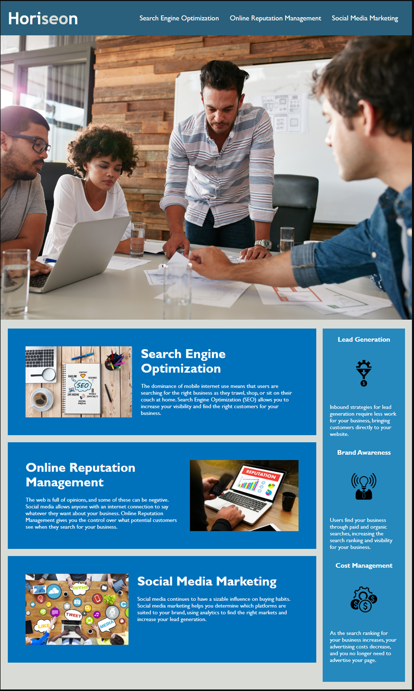

# refactor-corys-lemonade
Horiseon Social Solutions is a marketing agency that wanted a website that is optimized for search engines and is up to all accessibility standards. What we did for this client was consolidate css selectors and properties to clean up their code and make it look clean, as well as fix their links and left proper comments in CSS for all changes that were performed. 

https://corycarroll.github.io/Horiseon/

